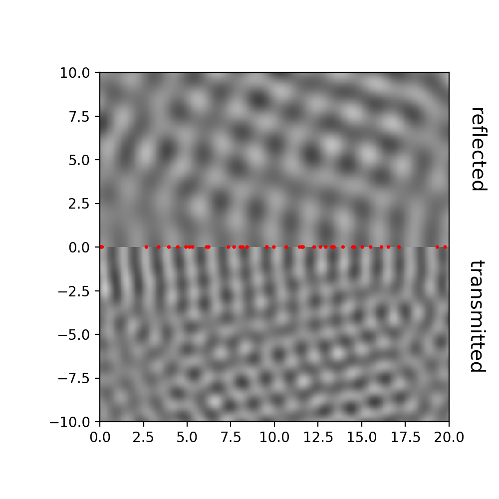

This is a sample blog post. Lorem ipsum I can't remember the rest of lorem ipsum and don't have an internet connection right now. Testing testing testing this blog post. Blog posts are cool.

Python code for illustrating the Huygens-Fresnel principle
======

Single source generates the spherical wave



$$
\begin{equation}
  U(\mathbf{r}, t) = \frac{\cos(-\omega t + k_2 |\mathbf{r}|)}{|\mathbf{r}|}
\end{equation}
$$


Adding sources, few at a time
------

```{python}
x = 'hello, python world!'
print(x.split(' '))
```

